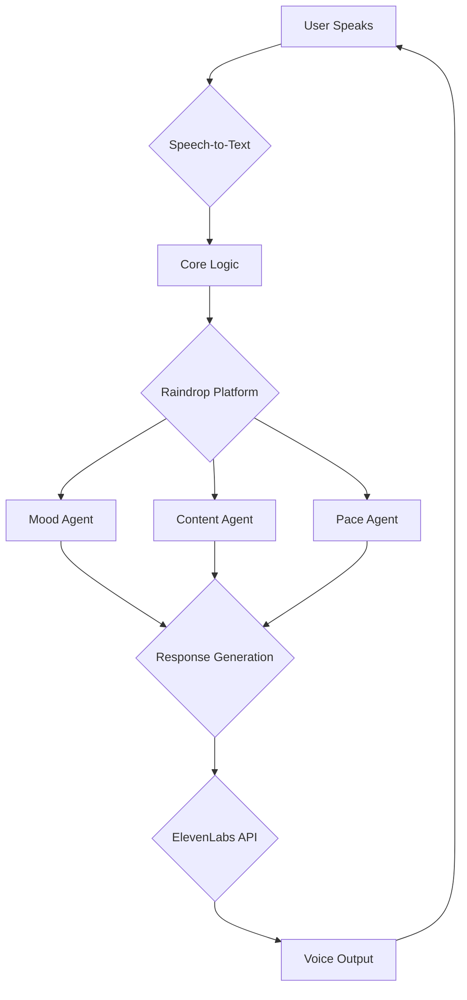

# TherapiBot Technical Architecture

**Project:** TherapiBot
**Date:** 2025-12-07

---

### 1. Overview

TherapiBot is a voice-driven AI agent designed to provide cognitive restructuring for common negative thoughts. The system is built around a multi-agent architecture orchestrated by the Raindrop platform, with voice interaction powered by ElevenLabs.

### 2. Core Components

The system consists of the following core components:

| Component | Technology | Description |
| :--- | :--- | :--- |
| **Voice Input** | User's Microphone | Captures the user's speech. |
| **Speech-to-Text** | Whisper (or similar) | Transcribes the user's speech into text. |
| **Core Logic** | Python | The main application logic that processes the user's input and orchestrates the agents. |
| **Raindrop Platform** | Raindrop MCP | Orchestrates the different AI agents (mood, content, pace). |
| **ElevenLabs API** | ElevenLabs | Generates the audio response. |
| **Voice Output** | User's Speakers | Plays the generated audio response. |

### 3. Architecture Diagram



### 4. Data Flow

1. The user speaks a negative thought (e.g., "I'm not good enough").
2. The Speech-to-Text component transcribes the speech into text.
3. The Core Logic sends the text to the Raindrop platform.
4. The Raindrop platform activates three parallel agents:
    - **Mood Agent:** Analyzes the emotional tone of the input.
    - **Content Agent:** Identifies the cognitive distortion in the thought.
    - **Pace Agent:** Determines the appropriate speaking rate for the response.
5. The outputs of the three agents are combined to generate a response.
6. The response is sent to the ElevenLabs API to generate a voice.
7. The audio is played back to the user.

### 5. Implementation Details

- **Programming Language:** Python 3.11
- **Key Libraries:**
    - `elevenlabs`: To interact with the ElevenLabs API.
    - `requests`: To make HTTP requests to the Raindrop platform.
    - `python-dotenv`: To manage environment variables (API keys).
- **Project Structure:**
    ```
    TherapiBot/
    ├── .gitignore
    ├── LICENSE
    ├── README.md
    ├── requirements.txt
    ├── docs/
    │   └── architecture.md
    ├── src/
    │   └── main.py
    ├── scripts/
    │   └── run.sh
    ├── assets/
    └── data/
    ```
